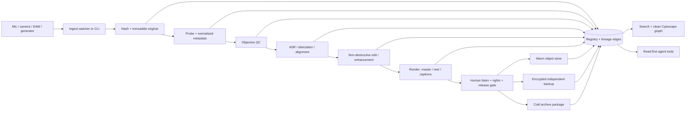

# Media Vault OS — Research and Stack Decision

**Observed:** 2026-08-05

**Scope:** spoken voice, narration, voice memos, music, video, reels, transcripts, quality evidence, provenance, storage, and archival recovery

**Decision status:** architecture selected; implementation remains phased and must not be described as already deployed

## Executive decision

No single GitHub repository or commercial application solves this safely end to end. The right system is a **small provider-neutral media control plane** that composes proven tools:

1. **Capture/edit in specialist applications** — REAPER or Hindenburg for spoken audio, OBS for camera/screen capture, DaVinci Resolve for editorial, and the existing Remotion stack for programmatic reels.
2. **Ingest every file through one immutable asset registry** — hash first, then probe, register, quality-check, transcribe, and create derivatives without overwriting the original.
3. **Keep media bytes in content-addressed storage** — active files hot-local, durable originals/masters in object storage, final packages in an independent cold/archive tier, and encrypted backup kept separate from the browsable object store.
4. **Keep truth in metadata and lineage, not folder names** — one asset ID, immutable blob hashes, processing receipts, transcript versions, rights state, replicas, and explicit graph edges.
5. **Give agents an API/CLI, never a filesystem crawl** — agents ask `where`, `search`, `transcript`, `quality`, or `lineage`; they do not recursively search personal storage.
6. **Use human approval for destructive cleanup, voice rights, flagship repair, archive deaccession, and publication.**

The existing `agentic-music-producer-os` is the best canonical code home because it already has generation receipts, downloaded-asset hashes, listening review, technical-QA sequencing, and a documented DAM/release gap. This Media Vault layer should become the shared post-capture and post-generation substrate. Existing products remain adapters rather than competing control planes:

| Existing estate asset | Verified current role | Media Vault relationship |
|---|---|---|
| [`agentic-music-producer-os`](https://github.com/frankxai/agentic-music-producer-os) | Machine-ready profile and guarded music-production receipts; explicitly incomplete as a full DAM/release system | **Canonical implementation repo** |
| [`starlight-voice`](https://github.com/frankxai/starlight-voice) | Tauri/Python voice operator; real mic/voice loop remains incomplete | Capture adapter later; not the archive |
| [`remotion-video`](https://github.com/frankxai/remotion-video) | Programmatic vertical video and local word-timestamp transcription starter | Reel/render adapter |
| [`suno-mcp-server`](https://github.com/frankxai/suno-mcp-server) | Music tool adapter/scaffold; not assumed to be a production generation API | Generated-audio import adapter |
| [`music-intelligence-systems`](https://github.com/frankxai/music-intelligence-systems) | Public Music/Sound Intelligence charter, no shipped runtime claimed | Doctrine/substrate, not storage |
| [`awesome-music-agent-skills`](https://github.com/frankxai/awesome-music-agent-skills) | Web-first catalog with a dated 2026-08-03 pulse | Discovery index, not runtime |

## What the system must answer

Every registered asset must make these questions deterministic:

- What is this, who/what created it, and when?
- Where is the original byte-for-byte file now?
- Which copies are hot, warm, cold, backup, or offline?
- What is the SHA-256 of every original and derivative?
- Which transcript, captions, stems, mix, master, reel, or published output came from it?
- Which tool/model/version/parameters produced each derivative?
- What did objective QC measure, and which human actually listened?
- What rights, consent, privacy, AI-role, and release approvals apply?
- Can the system restore an independently verified copy?

A filename, folder, waveform, transcript, generation URL, or Git commit alone cannot answer all of these.

## Physical recording chain

Software cannot rescue clipping, bad room reflections, plosives, unstable mic distance, or an intermittent cable without changing the voice. Choose the physical chain before buying more enhancement tools:

| Situation | Recommended class | Why |
|---|---|---|
| Ordinary/untreated room | Close-address cardioid broadcast dynamic microphone, USB/XLR as needed | Rejects more room sound and makes daily consistency easier |
| Treated narration room | Low-noise large-diaphragm condenser or high-quality broadcast dynamic | Captures more detail when room reflections/noise are already controlled |
| XLR chain | Stable interface/preamp with clean gain, direct monitoring and a documented input channel | Repeatable gain and redundant routing are more valuable than exotic plugins |
| Monitoring | Closed-back headphones plus a known reference speaker/headphone check | Detects hum, clipping, mouth noise, masking and over-processing before long takes |
| Mechanics | Quiet boom/stand, shock mount where needed, pop filter and repeatable mouth-to-mic distance | Prevents handling noise, plosives and changing tonal balance |
| Long/irreplaceable sessions | Independent safety recorder or second isolated track | Protects against application, driver, cable or clock failure |
| Room | Absorption at early reflection points, quiet ventilation/computer placement and a repeatable room-tone test | Better source acoustics sound more human than aggressive denoise |

The first purchase priority is usually **room/control/placement**, then microphone/interface reliability, then repair software. Equipment profiles make those choices measurable rather than anecdotal.

## Open-source decision matrix

GitHub activity and license fields below are dated discovery evidence from the GitHub API on 2026-08-05. `NOASSERTION` means GitHub did not return a dependable SPDX value; inspect the actual license and dependency/build configuration before embedding or redistributing.

| Layer | Candidate | Observed evidence | Decision | Reason / boundary |
|---|---|---|---|---|
| Capture | [OBS Studio](https://github.com/obsproject/obs-studio) | GPL-2.0; active 2026-08-05 | **Core capture adapter** | Reliable camera/screen/isolated-track capture; record crash-safe MKV and remux after capture |
| Audio edit | [Audacity](https://github.com/audacity/audacity) | GPL-3.0 in `LICENSE.txt`; active 2026-08-05 | Optional desktop tool | Useful for quick destructive edits, but it must not become the provenance system |
| Audio edit | [Ardour](https://github.com/Ardour/ardour) | GPL-2.0-or-later; active source mirror | Benchmark/alternative | Serious DAW; Windows usability and source/binary distribution details still need operator review |
| Media engine | [FFmpeg](https://github.com/FFmpeg/FFmpeg) | active 2026-08-05; build-dependent license | **Core** | Probe, transcode, remux, extract audio, render proxies, loudness analysis; record exact build/version |
| Technical metadata | [MediaInfo](https://github.com/MediaArea/MediaInfo) | BSD-2-Clause; active | **Core** | Stable normalized technical metadata for audio/video |
| Embedded metadata | [ExifTool](https://github.com/exiftool/exiftool) | GPL-3.0; active | **Core CLI adapter** | Read/write many metadata families; never rely on embedded tags as the only registry |
| Broadcast WAV | [BWF MetaEdit](https://github.com/MediaArea/BWFMetaEdit) | active; `NOASSERTION` | **Core for WAV/BWF** | Validates and edits BEXT/INFO metadata while retaining sidecar truth |
| Loudness | [pyloudnorm](https://github.com/csteinmetz1/pyloudnorm) | MIT; active 2026-01-04 | **Core Python metric** | ITU-R BS.1770-style loudness measurements; use versioned delivery profiles |
| Loudness | [libebur128](https://github.com/jiixyj/libebur128) | MIT; last push 2023 | Adapter via FFmpeg | Mature EBU R128 implementation; do not add a second meter unless parity-tested |
| Audio analysis | [librosa](https://github.com/librosa/librosa) | ISC; active 2026-08-03 | **Core analysis library** | Silence, spectral, onset, tempo, feature and preview analysis |
| Audio analysis | [Essentia](https://github.com/MTG/essentia) | AGPL-3.0; active | Defer/isolated service | Powerful music descriptors; license and deployment boundary require review |
| Noise reduction | [RNNoise](https://github.com/xiph/rnnoise) | BSD-3-Clause; maintained reference | Optional adapter | Real-time denoise; never replace the immutable raw recording |
| Noise reduction | [DeepFilterNet](https://github.com/Rikorose/DeepFilterNet) | Apache-2.0 or MIT; last push 2024-10-17 | Benchmark only | Strong candidate for difficult noise, but maintenance and model-quality evidence need review |
| ASR | [faster-whisper](https://github.com/SYSTRAN/faster-whisper) | MIT; last observed push 2025-11-19 | **Default local ASR** | Good throughput and word timing; store exact model/checkpoint and runtime |
| ASR fallback | [whisper.cpp](https://github.com/ggml-org/whisper.cpp) | MIT; active 2026-08-04 | **Low-footprint fallback** | Strong local/offline route across machines |
| Alignment | [WhisperX](https://github.com/m-bain/whisperX) | BSD-2-Clause; active 2026-07-13 | Optional post-ASR | Word alignment and diarization composition; heavier dependencies |
| Diarization | [pyannote-audio](https://github.com/pyannote/pyannote-audio) | MIT code; active | Conditional | Use only for multi-speaker assets; model access/terms must be recorded separately |
| Forced alignment | [Montreal Forced Aligner](https://github.com/MontrealCorpusTools/Montreal-Forced-Aligner) | MIT; active 2026-07-11 | Narration adapter | Precise alignment after a corrected script/transcript; requires suitable language/acoustic resources and is not ASR |
| Voice activity | [Silero VAD](https://github.com/snakers4/silero-vad) | MIT; active | Optional efficiency layer | Splits speech regions before ASR; never discard source silence/room tone |
| DAM benchmark | [ResourceSpace](https://github.com/resourcespace/resourcespace) | active; supports audio/video; `NOASSERTION` | **Benchmark, not first install** | Mature DAM UI and API; heavier than the first personal operating slice |
| Search scale-out | [OpenSearch](https://github.com/opensearch-project/OpenSearch) | Apache-2.0; active 2026-08-05 | Defer | Add only after PostgreSQL full-text/vector search has a measured corpus or latency problem; indexes are rebuildable projections |
| Media CMS | [MediaCMS](https://github.com/mediacms-io/mediacms) | AGPL-3.0; active | Defer | Useful publishing/review surface, not the canonical preservation registry |
| Local tagging | [TagSpaces](https://github.com/tagspaces/tagspaces) | AGPL-3.0; active | Optional human browser | Helpful manual browsing; sidecars/tags must round-trip into canonical metadata |
| Large-data versioning | [DVC](https://github.com/treeverse/dvc) | Apache-2.0; active | Project adapter, not archive | Useful for reproducible project snapshots; Git/DVC state is not offsite preservation proof |
| Content authenticity | [C2PA Rust SDK](https://github.com/contentauth/c2pa-rs) | Apache-2.0 and MIT; active 2026-08-05 | **Export provenance adapter** | Sign/inspect compatible FLAC, M4A, MP3, WAV, MP4/MOV and other supported outputs; does not replace internal lineage or rights records |
| Content authenticity UI | [C2PA JS](https://github.com/contentauth/c2pa-js) | MIT; active 2026-08-04 | Future viewer adapter | Browser/Node manifest reading and validation; the browser is not the signing authority |
| Edit lineage | [OpenTimelineIO](https://github.com/AcademySoftwareFoundation/OpenTimelineIO) | Apache-2.0; active | **Core for video/editorial interchange** | Durable timeline decisions and media references across editorial tools |
| Archive package | [BagIt Python](https://github.com/LibraryOfCongress/bagit-python) | active; GitHub license unset | **Core archive packaging candidate** | RFC 8493 manifests and payload packaging for reliable transfer/storage |
| Graph UI | [Cytoscape.js](https://github.com/cytoscape/cytoscape.js) | MIT; active | **Core graph UI** | Clean interactive lineage/replica graph without adopting a graph database first |
| Graph analysis | [NetworkX](https://github.com/networkx/networkx) | active; `NOASSERTION` | Optional analysis | Offline integrity checks, disconnected-node and cycle detection |
| Durable orchestration | [Temporal](https://github.com/temporalio/temporal) | MIT; active 2026-08-05 | **Preferred scale engine, deferred from phase 1** | Durable retries fit long media jobs, but every workflow needs idempotency so retries cannot duplicate upload, signing or publication |
| Orchestration alternatives | [Dagster](https://github.com/dagster-io/dagster) / [Prefect](https://github.com/PrefectHQ/prefect) | Apache-2.0; active | Defer | Valid alternatives if Temporal is rejected; do not operate two workflow control planes |
| Human integrations | [n8n](https://github.com/n8n-io/n8n) | Sustainable Use/fair-code, not OSI open source; active | Notification adapter only | Useful for approved notifications/integrations, not the authoritative media lineage runtime |
| Backup | [restic](https://github.com/restic/restic) | BSD-2-Clause; active | **Core encrypted backup** | Incremental, deduplicated, encrypted snapshots; prove restores, not only snapshots |
| Cloud transfer | [rclone](https://github.com/rclone/rclone) | MIT; active | **Core transport adapter** | Provider-neutral object copy/check; keep credentials outside the registry |
| Backup alternative | [Kopia](https://github.com/kopia/kopia) | Apache-2.0; active | Evaluate, do not run in parallel | Good Windows GUI/CLI; choose either restic or Kopia as the primary backup control plane |
| Self-hosted S3 | [MinIO](https://github.com/minio/minio) | AGPL-3.0; repository archived 2026-04-24 | Reject as a new default | Archived upstream plus operating and licensing burden make it a poor new foundation |
| Institutional preservation | [Archivematica](https://github.com/artefactual/archivematica) | AGPL-3.0; active 2026-08-05 | Defer | Standards-oriented preservation, but excessive operational weight until institutional accession requirements exist |
| Lossless trimming | [LosslessCut](https://github.com/mifi/lossless-cut) | GPL-2.0; active | Optional desktop adapter | Fast rough cuts without unnecessary re-encoding |
| Silence editing | [auto-editor](https://github.com/WyattBlue/auto-editor) | Unlicense; active | Optional proposal generator | Create reviewable cuts from silence/motion; never auto-delete or overwrite originals |
| Programmatic video | [Remotion](https://github.com/remotion-dev/remotion) | active; `NOASSERTION` | Existing adapter; license review | Strong deterministic reels/captions/motion; keep renderer outputs derivative and hash-bound |

## Commercial companion matrix

Commercial tools are not the source of truth. They are high-quality capture, repair, editorial, collaboration, or review surfaces that import/export through the registry.

| Tool | Verified official positioning on 2026-08-05 | Recommended use | Boundary |
|---|---|---|---|
| [REAPER](https://www.reaper.fm/) | Complete digital audio production application; official site showed v7.78 | **Default serious audio DAW** for narration, voice, music, automation, and non-destructive chains | Proprietary low-cost license; project files and renders must be registered |
| [Hindenburg](https://hindenburg.com/) | Spoken-word, radio, podcast, audiobook workflows | Best focused narration/editorial alternative | Do not let app-local projects become the only archive |
| [iZotope RX](https://www.izotope.com/products/rx-advanced) | Official site identified RX 12 Advanced as audio repair/post-production | Flagship rescue, de-click, de-noise, spectral repair | Manual/paid; preserve before/after and settings receipt |
| [Auphonic](https://auphonic.com/engine/) | Leveling, noise/reverb reduction, loudness, speech-to-text, metadata, API | Batch spoken-word finishing and benchmark | Cloud/privacy review; never upload protected audio by default |
| [DaVinci Resolve](https://www.blackmagicdesign.com/products/davinciresolve) | Integrated edit, cut, color, Fusion, Fairlight | **Default human video editor** | Proprietary/free+paid tiers; export OTIO/receipts where practical |
| [Descript](https://www.descript.com/) | Text-based video/podcast editing, transcription, recording | Optional collaboration/transcript editor | Cloud privacy, lock-in, and transcript export must be reviewed |
| [Frame.io](https://frame.io/) | File management, review/approval, camera-to-cloud | External review surface at team scale | Not canonical storage or rights authority |
| [iconik](https://www.iconik.io/) | Ingest, storage/asset management, search, review, automation/API | Enterprise/cloud MAM benchmark | Add only when multi-user review/search needs justify a second operational surface |

## Selected architecture

### Why not install a heavyweight DAM first?

The first failure mode is not lack of a beautiful asset browser. It is lack of immutable originals, hash identity, transcript/version contracts, processing lineage, quality evidence, replica truth, and restore proof. A heavyweight DAM can index bad state beautifully. Build the thin trustworthy substrate first; add ResourceSpace, iconik, or Frame.io as a replaceable view later.

### Why not use Git, OneDrive, or a folder tree as the archive?

- Git is excellent for code, schemas, prompts, and sanitized manifests; it is not a complete binary-media backup.
- Sync reflects deletions and corruption; it does not by itself prove retention or recovery.
- Folder names are mutable and ambiguous; byte hashes and registry IDs are stable.
- A generation URL, DAW project, transcript, or cloud asset card is not an original-file preservation receipt.

## Storage recommendation

Use three independent purposes rather than one overloaded cloud:

| Tier | Purpose | Default contents | Suggested mechanism |
|---|---|---|---|
| Hot local | Fast creation and review | Active originals, DAW projects, current proxies and masters | Local NTFS under a configured media root; content-addressed blobs; capacity guard |
| Warm object | Browsable durable media | Originals immediately after ingest; approved derivatives, transcripts, project packages | S3-compatible object storage such as Backblaze B2 with versioning/Object Lock where appropriate |
| Backup | Independent recovery | Encrypted snapshots of registry, manifests, originals, and irreplaceable project files | restic to an independent provider/repository; scheduled check + sampled restore |
| Cold archive | Long-term closed-project preservation | BagIt/RO-Crate-style final packages, manifests, masters, stems, transcripts, rights and receipts | S3 Glacier/Deep Archive or equivalent archive class after a restore-cost/latency decision |
| Rebuildable | Disposable derived data | Waveforms, spectrograms, embeddings, low-res proxies, ASR caches | Local/cache or warm object; regenerate from immutable originals |

Backblaze documents Object Lock as preventing change/deletion until a specified date and lifecycle rules for managing older versions. AWS documents archive and Deep Archive classes for asynchronously accessed long-term data. These mechanisms are useful only after retention, restore latency, egress, object-lock mode, and deletion authority are explicitly decided.

## Metadata and provenance standards

- **Internal authority:** the repository schema plus an append-only processing/event ledger.
- **Fixity:** SHA-256 required for every blob; optionally BLAKE3 for fast local dedupe, but SHA-256 remains the portable interchange hash.
- **Technical media:** `ffprobe`, MediaInfo, BWF/BEXT where applicable, and sidecar JSON.
- **Transcripts:** canonical JSON with word/segment timing plus TXT, WebVTT, and SRT exports.
- **Editorial:** OpenTimelineIO for timelines and edit decision interchange.
- **Content authenticity:** C2PA manifest on compatible public outputs when the signing boundary is available.
- **Archive transfer:** BagIt (RFC 8493) manifests; optional RO-Crate for richer research-object relationships.
- **Rights:** explicit consent, voice/reference rights, provider terms snapshot, AI role, human authorship/edits, release authority, and retention/deletion policy.

C2PA proves signed assertions about a compatible output; it does not prove that an assertion is true, that a voice was authorized, or that every internal source was retained. BagIt proves payload fixity/packaging; it does not understand the artistic meaning of the payload. The internal registry connects both.

## Recommended operating software, not a software pile

### Default daily stack

- **Record spoken audio:** REAPER with a fixed 48 kHz / 24-bit mono template; Hindenburg is the focused spoken-word alternative.
- **Record camera/screen:** OBS with isolated microphone audio; use MKV during capture and remux to MP4 after success.
- **Edit video:** DaVinci Resolve for human editorial; Remotion for deterministic branded reels and caption variants.
- **Ingest/probe:** Media Vault CLI/watcher + FFmpeg/ffprobe + MediaInfo + ExifTool/BWF MetaEdit.
- **Transcribe:** faster-whisper; add WhisperX and pyannote only when word alignment or multiple speakers require them.
- **Measure:** FFmpeg loudness/true-peak checks plus pyloudnorm/librosa; store measurements, command, tool version, and gate profile.
- **Repair:** light non-destructive DAW chain first; iZotope RX for flagship rescue; optional Auphonic batch adapter after privacy review.
- **Store/backup:** provider-neutral S3 object keys + rclone + restic; archive packages with BagIt.
- **Search/graph:** SQLite first, PostgreSQL when multi-machine concurrency arrives, Cytoscape.js for lineage and replica views.

### Explicitly defer

- A second always-on agent gateway.
- A graph database before relational edges become a measured bottleneck.
- Kubernetes, self-hosted distributed object storage, or lakeFS for one operator.
- Auto-deletion or agent-authorized deaccession.
- Cloud ASR/enhancement of private narration by default.
- A separate DAM/CMS/MAM deployment before the registry, hashes, restores, and workflows are proven.
- Embeddings as source of truth; semantic search is a disposable index over canonical metadata/transcripts.

## Phased build

| Phase | Deliverable | Exit evidence |
|---|---|---|
| 0 — Contract | Schema, example manifest, daily runbook, storage/rights profiles | JSON parses; docs and source register validated |
| 1 — Local vertical slice | `media ingest`, `media inspect`, `media qc`, `media transcribe`, `media where`; SQLite; local content-addressed blobs | One real voice memo goes capture → hash → QC → transcript → search without overwriting raw bytes |
| 2 — Durable replicas | S3 adapter, restic backup, replica verification, restore command, archive proposal | One sampled asset restored from an independent target with matching SHA-256 |
| 3 — Editing and reels | DAW/render import receipts, OTIO, Remotion/Resolve exports, caption packages | One narration source produces approved master + 9:16 reel with complete lineage |
| 4 — Clean UI and graph | Search, asset detail, quality history, transcript, storage map, Cytoscape lineage | Operator can answer what/where/derived-from without browsing folders |
| 5 — Multi-machine scale | PostgreSQL, C940 worker lane, Temporal durable workflows, and PostgreSQL search/pgvector | Idempotent retry, duplicate prevention, machine ownership, dead-letter recovery, and safe workflow versioning proven |
| 6 — Release/archive | C2PA signing where supported, BagIt/RO-Crate package, rights and release authority | Final package validates; publication remains independently human-authorized |

## Sources and evidence quality

**Primary GitHub evidence:** repository metadata and READMEs linked in the matrices, observed 2026-08-05. Activity/stars are discovery signals, not security or suitability guarantees.

**Primary standards/vendor evidence:** [C2PA specification](https://spec.c2pa.org/), [BagIt RFC 8493](https://www.rfc-editor.org/rfc/rfc8493.html), [Backblaze Object Lock](https://www.backblaze.com/docs/cloud-storage-object-lock), [Backblaze Lifecycle Rules](https://www.backblaze.com/docs/cloud-storage-lifecycle-rules), [AWS S3 storage classes](https://docs.aws.amazon.com/AmazonS3/latest/userguide/storage-class-intro.html), and the official commercial product pages linked above.

**Local estate evidence:** current repository files and GitHub descriptions. Historic Hermes sessions were used only to recover prior work; live repositories and current files control this decision.

## Bottom line

Build the **Media Vault substrate**, not another all-in-one media app. Keep REAPER/OBS/Resolve/Remotion as excellent creation surfaces, use proven open-source tools for probing/QC/transcription/backup, and make the registry the place agents learn what exists, where it lives, how it was produced, whether it is good, and whether it is safe to release.
